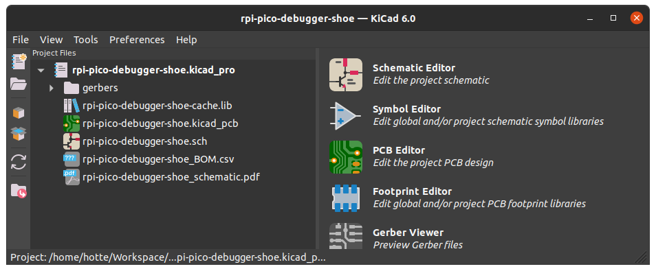
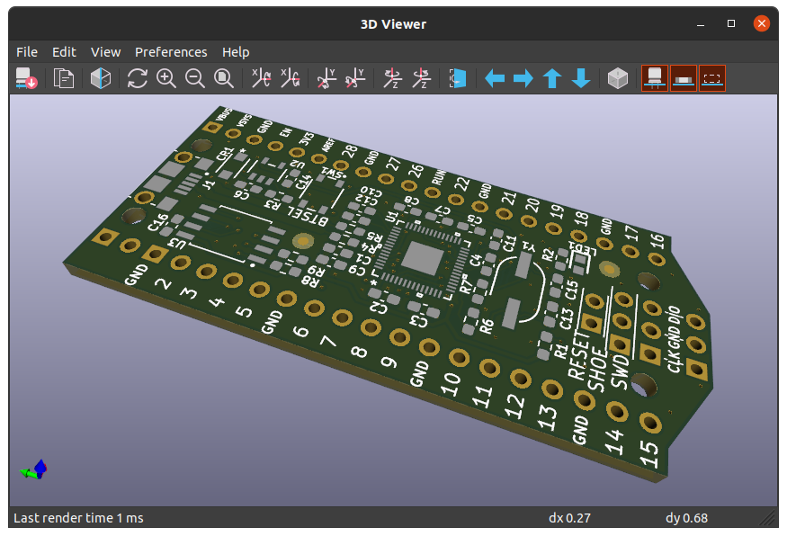
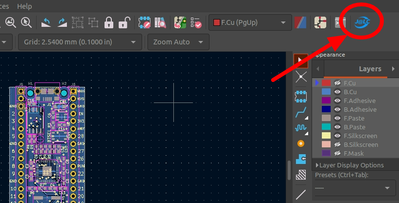
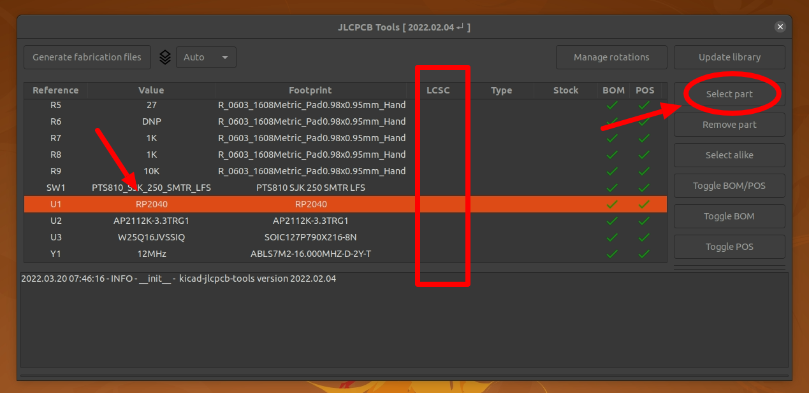
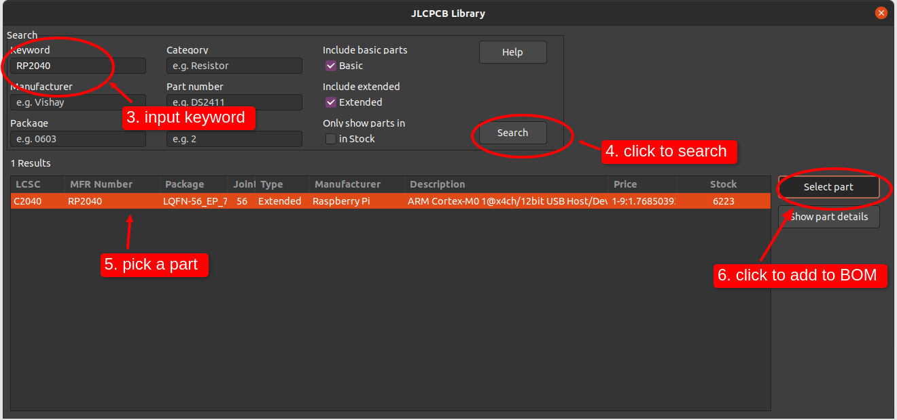
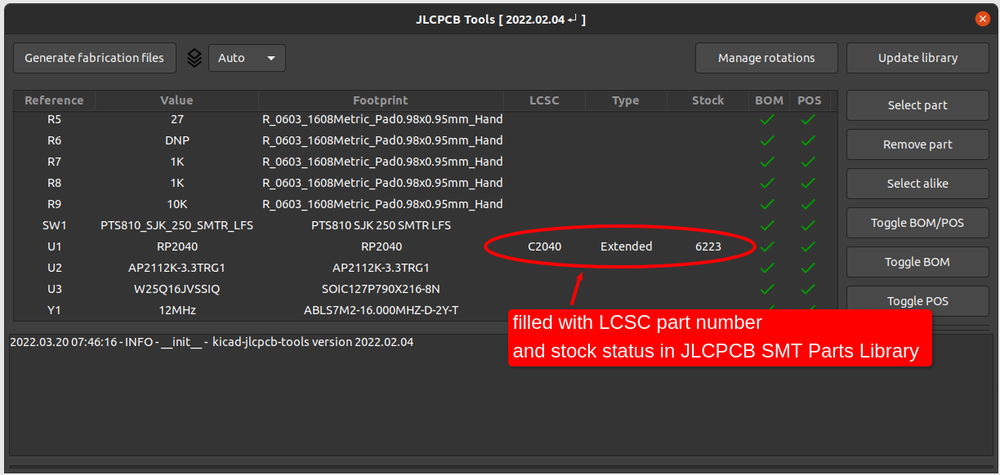
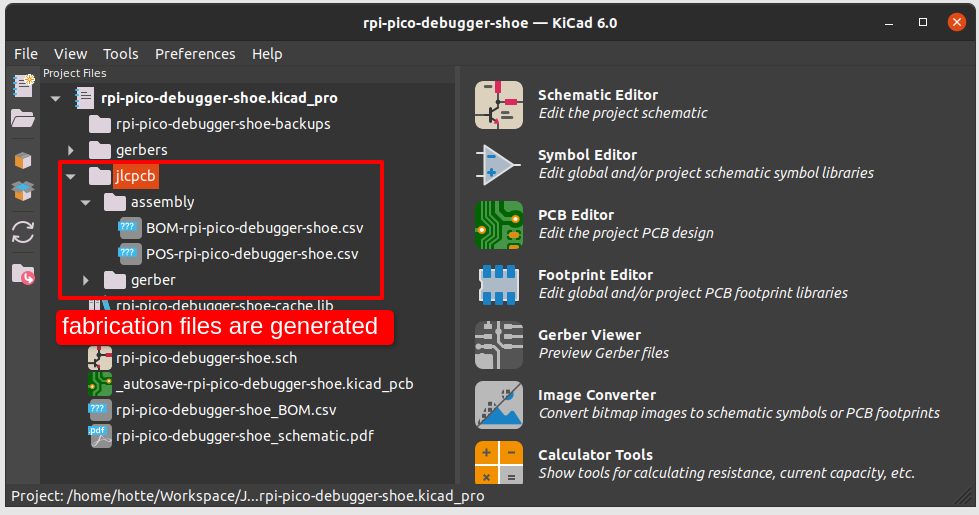

# [JLCPCB][1] SMT Assembly service - Raspberry Pico RP2040 KiCAD Design

In this article, we will explore how to get a KiCAD design fabricated and assembled by [JLCPCB][1] SMT Assembly service.

## Prerequisites

* [KiCAD 6][3]
* [KiCAD JLCPCB tools][4]

If you're reading this article, you'll probably have KiCAD installed on your computer.
But if not, download and install [KiCAD 6][3] from the official website.

> The following contents of this article is tested with KiCAD version 6. Older versions or Nightly builds are not tested.

There are several plugins to export JLCPCB compatible fabrication files (Geber, BOM, CPL).
As we can see in the table, [KiCAD JLCPCB tools][4] has the best reputation and community support (at this time of writing).

GIthub Repository | Author | Star | Fork | Contributors | Last Updated
------------------|--------|------|------|--------------|-------------
[KiCAD JLCPCB tools](https://github.com/Bouni/kicad-jlcpcb-tools) | Bouni bouni@owee.de | 244 | 28 | 10 | Feb 2022
[KiCad JLCPCB BOM Plugin](https://github.com/wokwi/kicad-jlcpcb-bom-plugin) | Wokwi <https://wokwi.com/> | 110 | 25 | 3 | 2021
[KiJLC](https://github.com/fullyautomated/KiJLC) | Fully Automated <https://fully.automated.ee/> | 12 | 8 | 2 | 2021
[KiCad BOM CPL Plugin](https://github.com/prrvchr/KiCad-BOM-CPL-Plugin) | prrvchr prrvchr@gmail.com | 3 | 2 | 1 | 2020

Install [KiCAD JLCPCB tools][4] on KiCAD as described in the doc.
* open KiCAD
* go to menu **Tools** > **Plugin and Content Manager**
* in the Plugin and Content Manager dialog, click **Manage** button
* in the opened Manage Repositories dialog, click **+** button
* copy and paste the following repository metadata URL `https://raw.githubusercontent.com/Bouni/bouni-kicad-repository/main/repository.json`
* click **Save** button
* click the dropdown named **KiCad official repository** and select **Bouni's KiCad repository**
* click **Install** button of **KiCAD JLCPCB tools** item on the left panel
* close the Plugin and Content Manager dialog

If installation worked, you could see a blue JLCPCB tools icon on the toolbar of PCB Editor.

## Starting from an Existing Design

> _Immature poets imitate: mature poets steal._ by T.S. Eliot

Just like graphics designers start from templates and software developers start from boilerplates, hardware designers can also start from a template or existing designs.
There are already plethora of resources we can use, including [the ofiicial Raspberry Pico design][5].
To help you to choose the right starting point, the following table summarizes some open-source hardware designs at the time of this writing.

Project/Board Name | Author | Resource | Designed with| Note
-------------------|--------|------------|--------------|-----
Raspberry Pico | Raspberry Pi Foundation | [Design File][5] | Allegro | The official hardware design of Raspberr Pico
Pro Micro RP2040 | SparkFun Electronics | [GitHub][6] | Eagle | Arduino Pro Micro footprint
Thing Plus RP2040 | SparkFun Electronics | [GitHub][7] | Eagle | Feather footprint
ItsyBitsy RP2040 | Adafruit Industries | [GitHub][8] | Eagle | ItsyBitsy footprint
RPi Pico Debugger Shoe | Shawn Hymel | [GitHub][9] | KiCAD | Raspberry Pico footprint

We'll use [RPi Pico Debugger Shoe][2] as a starting template, because
* it's designed with KiCad
* it has the same pinout as the official Raspberry Pico board
* this article is not for replacing other Raspberry Pico design howto guides like [the official guide][10].

But you can choose other resources as there are ways of importing Eagle and Allego designs from KiCad, or even you can create the design from scratch.

## Editing the design

Since we started from an existing design, let's say _editing the design_ instead of _designing the hardware_.

First of all download and open the design in your KiCad.
Some may do it by simple mouse clicking on the web browser, others would do it using the Git command line.
No matter how you downloaded it, you could see the following result after opening it.

You could change whatever in the design as your need.
But before publishing and using it in production, be sure to check the license of the original project.

We will assume that you changed something and ready to go for prototyping with the [JLCPCB][1] SMT Assembly service.

## Generating the Files for JLCPCB

Unlike some other PCBA manufacturers where the BOM, Geber, CPL files are treated manually by the sales and engineering employees, [JLCPCB][1] offers the online form to upload the files to get PCBA ordering done.
[JLCPCB][1] was one of the early suppliers that supported online ordering on the website.
Online PCBA ordering has pros and cons.
* Pros
  - transparent pricing, no hidden costs
  - 24/7 instant ordering
  - progress checking
* Cons
  - the files must be in the correct format

The Geber and CPL files are generated by the EDA software and hardly edited manually.
The problem comes from the BOM list file.
* Often the BOM file is edited manually after generating to meet the stock status of part suppliers. This can cause the BOM file format to break.
* JLCPCB SMT Assembly requires selecting parts from [JLCPCB SMT Parts Library][11]. It has a global sourcing feature in [part manager][11], it takes some lead time for the parts sourced from global suppliers to be ready for assembly.

To make this easier, we installed [KiCAD JLCPCB tools][4] already in the beginning.
We can start using this handy tool now.

On the opened popup window named __JLCPCB Tools__, you would see the BOM table with an empty LCLC column.
As you might know if you have some experience in JLCPCB ordering, the [JLCPCB parts library][11] is linked to the [LCSC][13] parts.

You need to choose a part (or multiple parts) in the list then click __Select part__ button on the right sidebar.
For example, we'll choose RP2040 in the list.

After repeating these steps for all the parts you want to assemble, you could get the BOM list is filled with the right information.
We can assure that our BOM is the most updated and has no shortage issue because we checked JLCPCB's stock status in live while filling in the BOM list.

After you finished filling the BOM list, just click the __Generate fabrication files__.
The files are generated in the `jlcpcb` folder in the project's root.
You may need to compress teh `jlcpcb/geber` folder to upload to the ordering form, if the zip file is not generated automatically (for example, as `Geber-<your-project-name>.zip`).

Now we have all the 3 files ready to upload to the [JLCPCB][1] SMT Assembly service page.
* `Geber-<your-project-name>.zip`
* `BOM-<your-project-name>.csv`
* `POS-<your-project-name>.csv`

## Conclusion and Further Readings

We've come through how to make a KiCad-designed RP2040 PCB ready to be made by the [JLCPCB][1] SMT Assembly service.
Although KiCad and RP2040 are mainly discussed, the above method can be used for any different kind of PCB design.
For example, you can choose one of your own KiCad projects to generate JLCPCB-compatible fabrication files.

If you have any questions directly related to JLCPCB, please read [JLCPCB SMT Assembly FAQs][14] first. Most of the common questions are already answered.

Thank you for reading to this end of the long text!

---

[1]: https://jlcpcb.com/HOT "JLCPCB Official Website"
[2]: https://github.com/ShawnHymel/rpi-pico-debugger-shoe "RPi Pico Debugger Shoe by Shawn Hymel"
[3]: https://www.kicad.org/download/ "KiCAD Official Download Page"
[4]: https://github.com/Bouni/kicad-jlcpcb-tools "KiCAD JLCPCB Tools plugin by Bouni"
[5]: https://datasheets.raspberrypi.com/pico/RPi-Pico-R3-PUBLIC-20200119.zip "Raspberry Pico Design File"
[6]: https://github.com/sparkfun/SparkFun_Pro_Micro-RP2040 "SparkFun Pro Micro RP2040"
[7]: https://github.com/sparkfun/SparkFun_Thing_Plus-RP2040 "SparkFun Thing Plus RP2040"
[8]: https://github.com/adafruit/Adafruit-ItsyBitsy-RP2040-PCB "Adafruit ItsyBitsy RP2040 PCB"
[9]: https://github.com/ShawnHymel/rpi-pico-debugger-shoe "RPi Pico Debugger Shoe"
[10]: https://datasheets.raspberrypi.com/rp2040/hardware-design-with-rp2040.pdf "Hardware design with RP2040"
[11]: https://jlcpcb.com/parts/HOT "JLCPCB SMT Parts Library"
[12]: https://smt.jlcpcb.com/HOT/smtPrivateLibrary?index=1
[13]: https://lcsc.com/
[14]: https://support.jlcpcb.com/article/83-smt-assembly-faqs "SMT Assembly FAQs"
